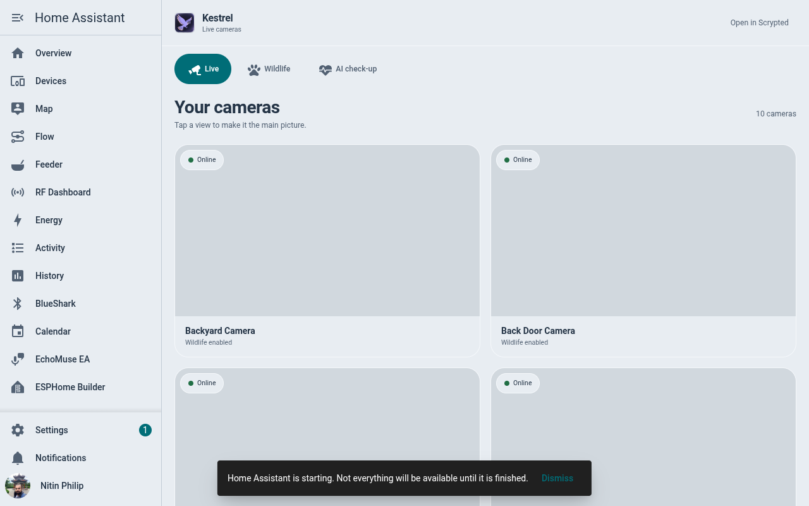
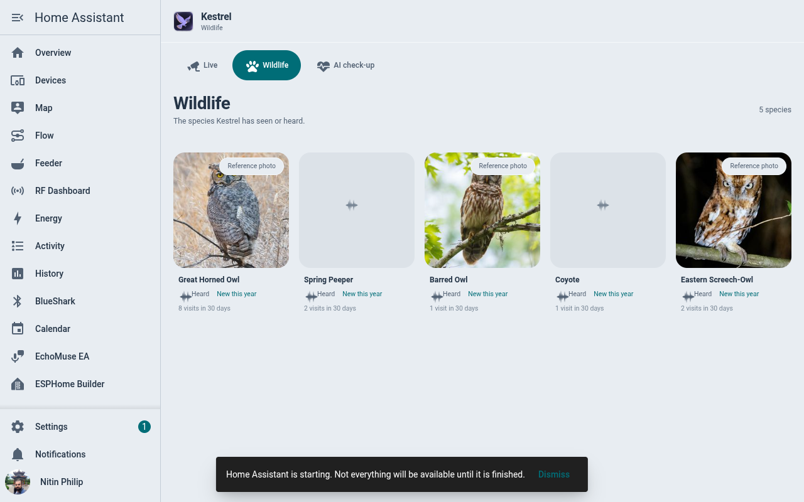
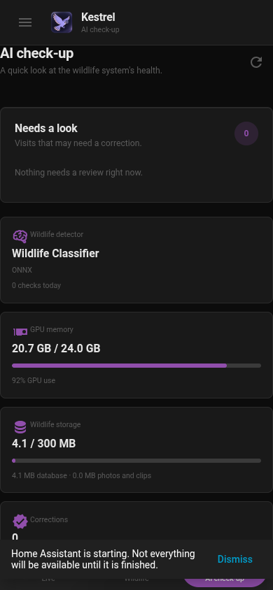

<p align="center"></p>

# Kestrel

A calm, fast **Cameras** panel for Home Assistant, built on
[Scrypted](https://scrypted.app), with wildlife AI on top: it names the birds
and animals your cameras **see** and **hear**, keeps a life list, sends a
notification that opens straight to the clip, and learns from your corrections.

Kestrel deliberately does **not** copy what Scrypted already does well (recording
timelines, scrubbing, search, face training) — every view links out to Scrypted
for those.

| Live | Wildlife | AI check-up (phone, glass theme) |
|---|---|---|
|  |  |  |

## What you get

- **Live** — every Scrypted camera in one grid with honest status chips
  (Online / Unstable / Offline, "Snapshot only" where there is no stream). Tap for
  the focused player; "Open in Scrypted" for history.
- **Visit** — where a notification lands: the snapshot immediately, a
  "Saving clip…" progress bar while the recorder finishes, then the clip plays.
  Tap an old notification later and it just plays.
  An administrator can delete a visit's clip from its page ("Delete clip"), or prune many
  at once under the gear button (Settings, **Saved clips**): all clips older than 1 month,
  3 months, 6 months or a year, or those from visits marked *Not an animal* / *Can't tell*.
  Every delete first says how many clips go and how much space that frees, and that photos
  and visits are kept; only the video is removed.
- **Wildlife** — your life list: every species seen or heard, best photo (or a
  labelled reference photo with its photographer and licence), first/last seen,
  which cameras, what time of day, new-this-year badges, and the recorded call for
  heard species.
- **Play reference** — on any species (its sheet, and a heard visit) *Play reference*
  plays what it actually sounds like, labelled *Reference · Xeno-canto* or
  *Reference · iNaturalist* so it is never mistaken for one of your own recordings,
  with who recorded it and under which licence. Birds get a *Song* and a *Call* when
  the source has them.
- **Corrections** — "Wrong?" on any visit: pick the right species (suggestions
  first), *Not an animal* or *Can't tell*. The visit is fixed everywhere at once,
  similar-looking animals at that camera are relabelled after a few corrections of
  the same mix-up, and the retrain tool can teach the model itself.
- **AI check-up** — a review queue for unsure calls, cameras that trigger AI checks
  with nothing found, detector / GPU / storage health, and BirdNET status.
- **Notifications** — one per visit, with the snapshot, deep-linked to the visit.

Built in the **Lucent** design language on the shared
[lucent-ha](https://github.com/nphil/lucent-ha) toolkit: it takes its colours
from your Home Assistant theme (flat or glass), keeps the menu button one tap
away, closes a sheet with Back before leaving a page, remembers each tab's
scroll, works from 320 px phones to wide screens, and stays light — one ~75 KB
(gzipped) bundle, bounded storage, no polling. After Home Assistant restarts,
open pictures and recordings come back by themselves, with no reload.

## How it fits together

```
cameras ─▶ Scrypted NVR ─▶ Wildlife Classifier (ONNX, GPU) ─┐
                         └▶ Events Recorder (clips) ─────────┤
camera mics ─▶ BirdNET-Go (HA app, Perch v2) ─▶ MQTT ────────┤
                                                             ▼
                              Kestrel Scrypted plugin (visits, corrections, media, API)
                                                             │  key-authenticated LAN API
                                                             ▼
                              Kestrel HA integration ─▶ entities, WebSocket API, signed media
                                                             ▼
                                                  Cameras panel (sidebar)
```

| Folder | What it is |
|---|---|
| [`scrypted-plugin/`](scrypted-plugin) | `@nphil/kestrel` — the Scrypted plugin: turns detections and BirdNET calls into visits, links clips, stores corrections and learning data in SQLite with strict retention, serves the API and media. |
| [`custom_components/kestrel/`](custom_components/kestrel) | The Home Assistant integration (HACS): config flow, entities, WebSocket API for the panel, authenticated media proxy, brand icons. |
| [`dashboard/`](dashboard) | The panel (Lit + TypeScript on lucent-ha), built into the integration. |
| [`classifier/`](classifier) | The Wildlife Classifier: EVA-02 (iNaturalist 2021) trimmed to your local species, exported to ONNX for Scrypted; evaluation and the retrain tool. |
| [`audio-eval/`](audio-eval) | The bird-sound model bake-off behind the BirdNET-Go settings ([results](audio-eval/results.md)). |
| [`tools/`](tools) | Reproducible brand and banner renderers. |

## The models, and how well they do

**Seeing — Wildlife Classifier.** [EVA-02 Large fine-tuned on iNaturalist 2021](https://huggingface.co/timm/eva02_large_patch14_clip_336.merged2b_ft_inat21),
cut down to the birds and mammals recorded near home (268 classes for the Atlanta
area). On 390 photos taken 2023 or later (so neither model trained on them),
against Scrypted's stock bird classifier:

| Birds | Kestrel | Stock |
|---|---|---|
| Clear photo, first guess right | **86%** | 40% |
| Camera-quality crop | **64%** | 17% |
| Night (IR) | **42%** | 4% |

Mammals, which the stock model can't name at all: 87% / 62% / 44%. About 100 ms per
animal on a Tesla P40. Details: [`classifier/README.md`](classifier/README.md).

**Hearing — BirdNET-Go with Google Perch v2.** Tested on 483 local bird calls mixed
into real audio from the cameras: Perch v2 beat BirdNET v2.4 at every loudness
level (59/50/32% vs 53/37/11% loud/medium/faint) with **zero** false alarms on bird-free
audio. Audio "clean-up" filters didn't reliably help, so none run live.
Details: [`audio-eval/results.md`](audio-eval/results.md).

## Install

1. **Classifier** — build and install into Scrypted's ONNX plugin
   ([`classifier/README.md`](classifier/README.md)), attach it as the *Animal Classifier*
   on your exterior cameras.
2. **Scrypted plugin** — `cd scrypted-plugin && npm install && npm run build &&
   npm run scrypted-deploy <scrypted-host>:10443`. In its settings pick the cameras
   to watch; copy the API key it shows.
3. **Home Assistant integration** — HACS → Custom repositories → add
   `https://github.com/nphil/kestrel` (Integration) → install → restart → add
   *Kestrel* with the plugin URL (`http://<scrypted-host>:11080/endpoint/@nphil/kestrel/public/`)
   and the key. A **Cameras** item appears in the sidebar.
4. **Optional: hearing** — install the BirdNET-Go app, enable the Perch v2 model,
   add the camera streams by name, and point its MQTT at your broker (topic
   `birdnet`, HA discovery off); map stream names to cameras in the plugin settings.
   Set the app's `BIRDSONGS_FOLDER` option to `/media/birdnet-go/clips` (create the
   folder first): Home Assistant's backups include app folders but not `/media`, so
   30 days of recordings would otherwise grow every nightly backup by several GB.
   Perch hears more than birds: mammals and frogs are kept (event types `mammal` /
   `other`), insects are ignored.
   **Bird-call previews** (optional): run the `kestrel-audio` service on a machine
   with a GPU (or a few CPU cores), then enter its address and key under Settings →
   Devices & Services → Kestrel → Configure. Each heard call is then played as the
   moment the model matched, made loud and, only where a re-check proves it helps,
   cleaned up, with an *Original* toggle to hear BirdNET-Go's full recording. Home
   Assistant sends the service every new call and, gradually, past calls too (the
   *Backfill past calls (days)* setting: 30 by default, 0 sends only new calls;
   raising it later only sends what is missing). If the service is off or
   unreachable, calls simply play the original recording.
   BirdNET-Go sometimes announces a call with detection number 0 but a real clip
   (the same species was heard on the other camera moments earlier). Those calls
   are played from the clip by its name, always as the original recording, because
   the preview service is keyed by detection number.
   **Local species filter**: the panel's gear button (Settings) shows how many species
   BirdNET-Go currently allows near you and lets a Home Assistant administrator choose
   how strict that is (Loose 1%, Balanced 3%, Strict 5%, Very strict 10%). Kestrel
   changes only BirdNET-Go's range-filter threshold and keeps its other settings;
   BirdNET-Go then rebuilds its species list, which takes a few seconds.
5. **Optional: reference sounds and photos** — nothing to set up: *Play reference* uses
   recordings from [iNaturalist](https://www.inaturalist.org). For clearer, quality-rated
   songs and calls, add a free [Xeno-canto](https://xeno-canto.org) API key (shown on
   your account page there) under Settings → Devices & Services → Kestrel → Configure;
   it is tried first and iNaturalist fills in what it lacks. A species is looked up
   the first time you press the button and the answer is kept 45 days (7 days when
   nothing was found). A recording is downloaded the first time it is played and kept
   on the Home Assistant host (at most 64 MB in `.storage/kestrel_reference`, least
   recently played removed first). (Cornell's Macaulay Library, which Merlin uses, is
   not an option: its search is behind a bot check.)
   **Reference photos** work the same way and need nothing either: a species without a
   photo of your own gets BirdNET-Go's picture if it has one (birds), else iNaturalist's
   default photo (mammals, frogs, insects), else the picture of its Wikipedia article.
   The panel names the photographer and licence under the picture. Looked-up pictures
   are kept 30 days (a week when no source has one) and downloaded on first view into
   `.storage/kestrel_reference_photos` (at most 48 MB, least recently shown removed first).
6. **Optional: notifications** — an automation on the `event.kestrel_*` entities;
   each event carries `species`, `visit_id`, `notify` and `first_ever`, and the visit
   page is `/kestrel/visit?v=<visit_id>`. An event fires once, when a visit is first
   created; later changes to that visit (its clip finishing, a correction, a merge)
   never fire it again, not even after Home Assistant restarts.

**Camera clips stopped (visits say "No clip was saved").** Kestrel looks for a visit's clip at the
Events Recorder plugin first; if that has none 90 seconds after the visit started, Kestrel cuts the
clip itself from Scrypted NVR's continuous recording (5 s before the visit to 10 s after it, at most
60 s, H.264). Visits that already ended with no clip are given the same second chance at start-up and
once a day, as long as the NVR still has the footage (its "Video Retention (Days)", 3 by default), so
an outage of the Events Recorder is recovered rather than lost. Every clip is also copied into
Kestrel's own store on the NVR disk (`/NVR/kestrel/clips/<camera>/<visit>.mp4`), which neither the
Events Recorder's pruning nor the NVR's retention touches. The Events Recorder's published 0.0.52
(2026-10-05) does not load in Scrypted, and when it does run it saves a snapshot for every detection
update. `python3 tools/patch_events_recorder.py` downloads that release, fixes both and redeploys it;
re-run it if Scrypted reinstalls 0.0.52, and retire it once upstream ships a release that loads.

## Privacy and footprint

- Everything runs locally, with one exception: *Play reference* and the reference photos
  ask iNaturalist, Wikipedia (and Xeno-canto, if you added a key) for a recording or
  picture of a species **by name**, from the Home Assistant host. No picture, recording
  or camera data is sent, the browser never contacts those sites, and your Xeno-canto
  key goes only to Xeno-canto and is never written to a log or to diagnostics.
- The plugin API requires a key; media reaches the browser only through Home
  Assistant with signed, expiring links.
- Snapshots and crops are kept 30 days (except the best photo per species and
  corrected examples), visit history 3 years, learning data capped; Kestrel stays
  within a 300 MB budget and reports its size on the AI check-up page.
- Microphones near doors hear people: choose which cameras BirdNET-Go listens to,
  and keep its web UI behind Home Assistant.

## Development

- Home Assistant integration tests need no Home Assistant install:
  `python3 -m unittest discover -s tests -v`.
- Plugin tests: see [scrypted-plugin/README.md](scrypted-plugin/README.md).

## Licences

- Kestrel code: MIT ([LICENSE](LICENSE)).
- EVA-02 iNat21 weights (timm): CC BY-NC 4.0 — personal, non-commercial use; the
  exported classifier inherits this.
- Inter typeface (`tools/fonts`): SIL Open Font License.
- BirdNET-Go and its models keep their own licences.
- Reference recordings belong to their recordists (Xeno-canto: Creative Commons,
  mostly BY-NC-SA; iNaturalist: the observer's licence, sometimes all rights
  reserved). Kestrel names the recordist and links to the recording's page; it is for
  personal, non-commercial listening.
- Reference photos belong to their photographers (iNaturalist: the photographer's
  licence, often all rights reserved; Wikipedia: the Wikimedia Commons licence, shown
  with the picture). Kestrel names the photographer and links to the source; it is for
  personal, non-commercial viewing.
